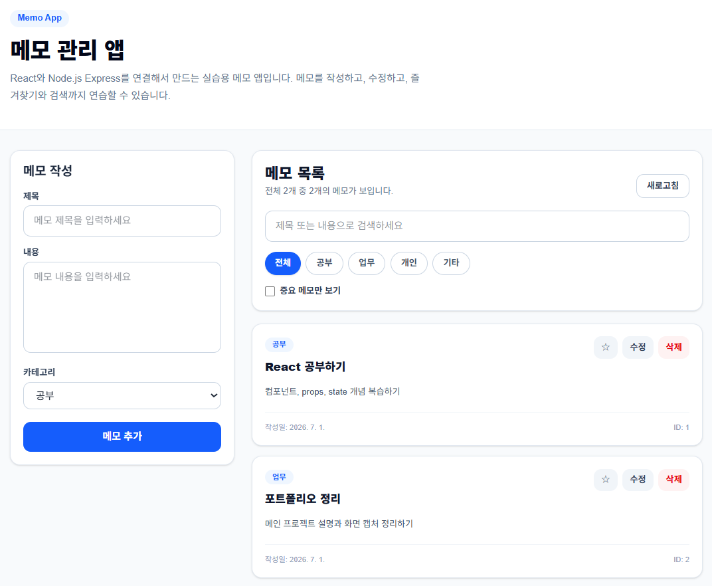

# Memo App

React와 Node.js Express를 사용해서 만든 메모 관리 앱입니다.  
TodoList 앱을 확장하여 메모 작성, 수정, 삭제, 중요 표시, 검색, 카테고리 필터 기능을 구현했습니다.

## 프로젝트 목적

Memo App은 TodoList CRUD 학습을 확장하여 메모 작성, 수정, 삭제, 중요 표시, 검색, 카테고리 필터 기능을 구현한 프로젝트입니다.

React와 Express를 분리하여 프론트엔드와 백엔드가 REST API로 통신하는 구조를 학습하는 데 목적이 있습니다.

## 화면 미리보기

메모 작성, 카테고리 선택, 검색, 필터링, 수정/삭제 기능을 한 화면에서 사용할 수 있도록 구성했습니다.



## 주요 기능

- 메모 목록 조회
- 메모 추가
- 메모 수정
- 메모 삭제
- 중요 메모 표시
- 중요 메모만 보기
- 제목/내용 검색
- 카테고리 필터
- 메모 개수 표시
- Tailwind CSS 기반 반응형 UI

## 핵심 구현 내용

- React state로 메모 목록, 입력 폼, 수정 상태, 검색어, 카테고리 필터, 중요 메모 필터를 관리했습니다.
- `useEffect`를 사용해 앱 초기 진입 시 백엔드에서 메모 목록을 불러오도록 구현했습니다.
- `fetch API`로 Express REST API와 연동하여 메모 생성, 조회, 수정, 삭제, 중요 상태 변경을 처리했습니다.
- 검색어와 카테고리, 중요 여부를 조합해 사용자가 원하는 메모만 확인할 수 있도록 필터링 로직을 구성했습니다.
- 중요 메모를 우선적으로 보여주도록 정렬 로직을 적용했습니다.
- Tailwind CSS를 사용해 반응형 UI와 조건부 스타일을 구현했습니다.

## 기술 스택

### Frontend

- Vite
- React
- Tailwind CSS
- fetch API

### Backend

- Node.js
- Express
- CORS
- Memory Array

## 데이터 구조

현재 데이터는 별도 데이터베이스가 아닌 Memory Array 기반으로 관리됩니다. 서버를 재시작하면 저장된 메모 데이터가 초기화되며, 향후 MongoDB 또는 MySQL 연동으로 데이터 영구 저장을 개선할 수 있습니다.

```js
{
  id: 1,
  title: "React 공부하기",
  content: "컴포넌트, props, state 개념 복습하기",
  category: "공부",
  important: false,
  createdAt: "2026-07-01T00:00:00.000Z",
  updatedAt: "2026-07-01T00:00:00.000Z"
}
```

## 폴더 구조

```txt
memo-app/
  backend/
    server.js
    package.json

  frontend/
    src/
    package.json
    vite.config.js

  docs/
    Memo_App_PRD.pdf
    memo-app-main.png

  README.md
  .gitignore
```

## 실행 방법

### 1. 백엔드 실행

```bash
cd backend
npm install
npm run dev
```

백엔드 서버 주소:

```txt
http://localhost:3000
```

### 2. 프론트엔드 실행

```bash
cd frontend
npm install
npm run dev
```

프론트엔드 주소:

```txt
http://localhost:5173
```

## API 명세

| 기능           | Method | URL              |
| -------------- | ------ | ---------------- |
| 메모 목록 조회 | GET    | `/api/memos`     |
| 메모 추가      | POST   | `/api/memos`     |
| 메모 수정      | PUT    | `/api/memos/:id` |
| 중요 상태 변경 | PATCH  | `/api/memos/:id` |
| 메모 삭제      | DELETE | `/api/memos/:id` |

## 트러블슈팅

- 프론트엔드와 백엔드가 서로 다른 포트에서 실행되기 때문에 CORS 설정을 추가하여 API 요청이 차단되지 않도록 처리했습니다.
- 메모 추가와 수정 시 제목과 내용이 비어 있으면 서버에서 `400` 응답을 반환하도록 검증 로직을 추가했습니다.
- 존재하지 않는 메모를 수정, 삭제, 중요 상태 변경하려는 경우 `404` 응답을 반환해 예외 상황을 구분했습니다.
- 서버 재시작 시 Memory Array 데이터가 초기화되는 한계를 확인하고, 데이터베이스 연동 필요성을 개선 사항으로 정리했습니다.

## PRD 문서

- [PRD 문서 보기](docs/Memo_App_PRD.pdf)

## 향후 개선 사항

- MongoDB 또는 MySQL을 연동해 메모 데이터를 영구 저장하도록 개선
- 카테고리 직접 추가 및 관리 기능 구현
- 메모 작성일과 수정일 기준 정렬 옵션 추가
- 입력값 검증과 에러 메시지 UI 개선
- 배포 환경에 맞춘 API 주소 설정 방식 개선

## 학습 포인트

- React state 관리
- useEffect를 이용한 초기 데이터 로딩
- fetch API를 이용한 백엔드 연동
- Express REST API 구현
- 배열 기반 CRUD 처리
- Tailwind CSS 조건부 스타일링
- 프론트엔드와 백엔드 분리 구조 이해
